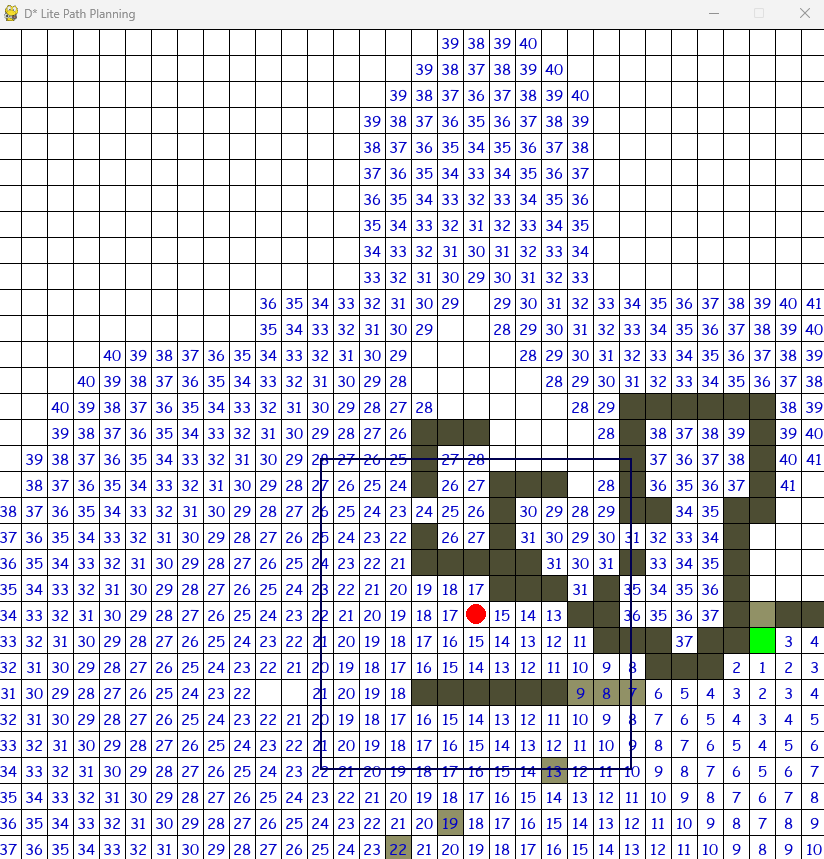
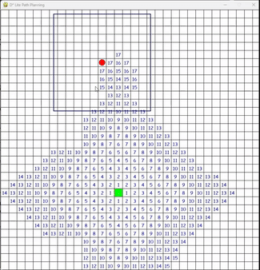

# What is D star?

D* is a dynamic path finding algorithm for unlimited size of map.  
The directional weight is added so that the entity can find the fastest route to the destination with the less effort. 

The entity calculates the available path on every each movement with dynamic obstacles; meaning obstacles can be added or removed on every movement. 
This algorithm can be applied into
 - IoT robots where it gets back to the station where multiple obstacles change happens.
 - Path fining in games (e.g. RimWorld?)
 - Real world exploration in drastic environmental changes when destination is given.

Our goal was to apply d-star lite and visualize so that we can understand the non-deterministic program behaviors.

# How to run application

1. install python 3
2. setup python environment variables to allow python commands in all directories.
3. Download repository
4. After the download, run following command.

   1. From the source root path type in the command
        `cd d-star-algorithm\d-star-lite`
   2. Then, run the following command
   `py main.py` or `python main.py`

## Things to know before running

### Block explanation
- **Red** is the moving entity.
- **Green** is the destination.
- **White** boxes are available paths (number indicates the effort weight).
- **Olive** boxes are obstacles which entity cannot go across.

### Key instructions
- `Left-click` on the white
- `spacebar` to take a next step

### Limitations and future improvements
1. Cannot remove obstacles after added.
2. Always start with the random map, random starting point, and random destination.
3. No click-and-drag to add or remove multiple obstacles in easier way.

### Potential bug
- Infinite loop happens when obstacle is place right in front of the moving entity making adjacent nodes' weights the same or not changing.
    - This can be fixed by adding history weight (add weight on visited area).

## d-star-algorithm
Implemenation of d star inspired by https://github.com/mdeyo/d-star-lite

